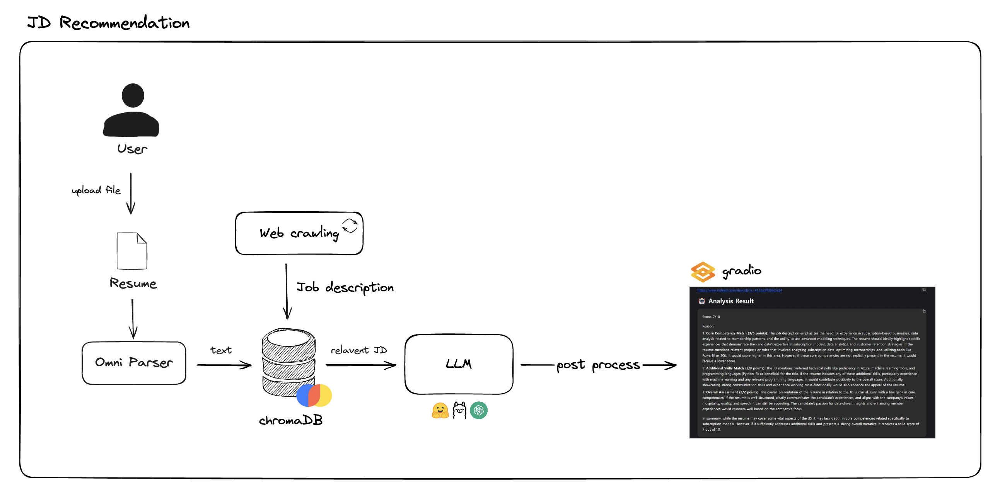
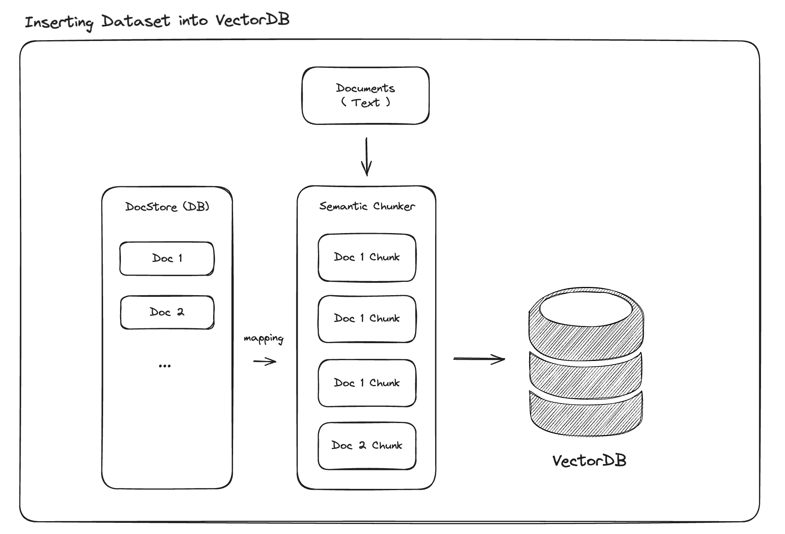

# JobPT

## 서비스 개요

현대 사회에서 취업 준비는 반복적이고 시간 소모적인 과정으로, 구직자가 자신의 역량을 효과적으로 어필하지 못해 기회를 놓치는 경우가 많습니다. 이를 해결하기 위해, JobPT는 **직무 공고 필터링, 회사 정보 요약 제공, 이력서 분석 및 맞춤형 피드백** 기능을 갖춘 지능형 취업 지원 서비스를 제공합니다.

## 주요 기능

1. **LLM 기반 개인 맞춤형 매칭**

    - 제공받은 이력서를 RAG를 활용해 각 회사의 채용 공고와 의미론적 유사도를 기반으로 적합한 회사를 추천합니다.

2. **회사 관련 정보 요약 제공**

    - LLM을 통해 원하는 회사 또는 추천된 JD의 회사와 관련된 최신 정보를 요약해 제공합니다.

3. **이력서 평가**

    - LLM을 통해 이력서와 매칭된 회사에 채용 공고에 대한 현재 점수를 평가합니다. 프롬프팅을 통해 기술 적합성, 핵심 역량, 종합 점수를 평가하도록 지시하여 현재 점수를 제공합니다.

4. **이력서 개선**

    - LLM을 통해 평가 점수에 따른 개선점을 제공합니다. 높은 점수를 받은 항목은 이력서에서 더욱 강조할 수 있도록 개선합니다. 반대로, 점수가 낮은 부분에 대해서는 부족한 역량이나 경험을 보완할 수 있는 내용을 제안합니다.

5. **LLM을 통한 대화형 평가 및 개선 반복**
    - LLM과 대화를 통해 평가-개선-재평가 프로세스를 거치며 이력서를 반복적으로 개선합니다. Multi-turn을 활용해 제공받은 개선점을 보완해가며 평가 점수를 높힙니다.

## 시스템 전체 구조도



### 주요 기술

-   **크롤링**: 여러 회사 JD 데이터 확보
-   **PDF 파싱**: MS OmniParser를 사용해 컴퓨터 비전 기반 PDF 텍스트 추출
-   **Vector DB**: ChromaDB를 사용해 이력서 텍스트 Chunk 저장
-   **LLM**
    -   이력서 평가 및 개선 기능에 활용 (ChatGPT API 사용)
    -   회사 정보 및 뉴스 요약에 활용 (Huggingface Qwen2.5 모델 사용)
-   **Gradio**: 웹서비스 구동용 인터페이스에 활용
-   **LangChain**: LLM 추론 및 멀티턴 시스템 구현을 위해 사용

## DB 구조도



## 서비스 데모
### 시연 영상
-   [데모 유튜브 링크](https://www.youtube.com/watch?v=m6EhfmpShCg)
### 웹 화면


## 시스템 구동 방법

OmniParser 폴더 압축 해제

-   system 폴더안에 사전 제공된 OmniParser_v1.zip 파일을 압축해제
-   반드시 OmniParser_v1 폴더명이여야 함

프로젝트 패키지 설치

```
pip install -r requirements.txt
```

OPENAI_API_KEY 등록

```
export OPENAI_API_KEY=<your_openai_key>
```

Chroma DB 세팅

```
cd system
python insert_chunks.py
```

API 실행

```
python system/main.py
```

Gradio 앱 실행

```
python gradioapp.py
```

API 호출 예시 (api_test.py 참조)

```
import requests

# POST 요청 함수
def send_post_request(resume_path):
    url = "http://localhost:8000/matching"  # 실제 API 엔드포인트로 변경하세요.
    data = {"resume_path": resume_path}

    try:
        response = requests.post(url, json=data)
        response.raise_for_status()  # 상태 코드가 200번대가 아니면 예외 발생
        print("POST 요청 성공:", response.json())
    except requests.exceptions.RequestException as e:
        print("POST 요청 중 오류 발생:", e)


# 함수 호출 예시
send_post_request("data/joannadrummond-cv.pdf")
```
