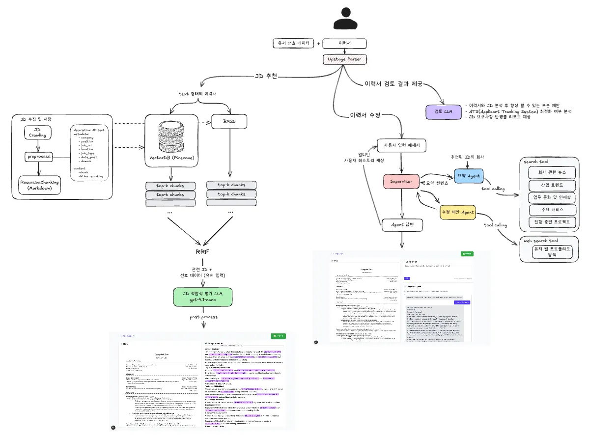
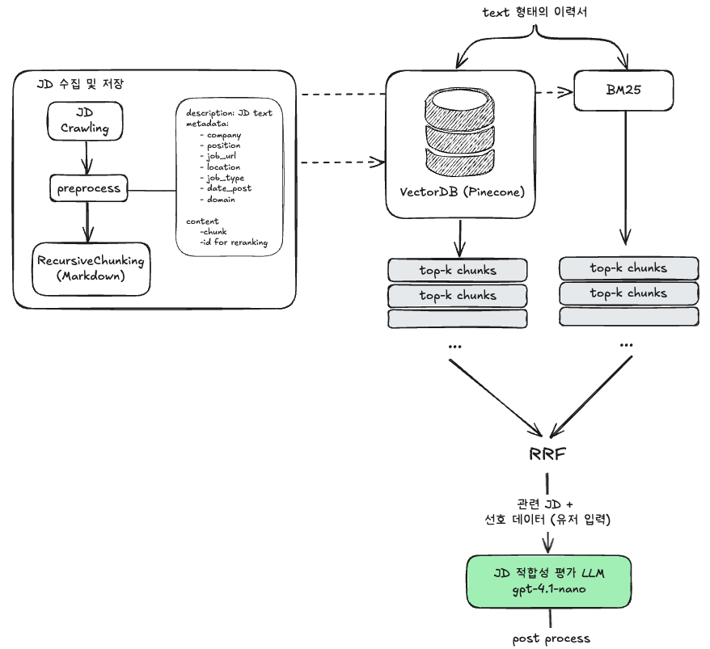
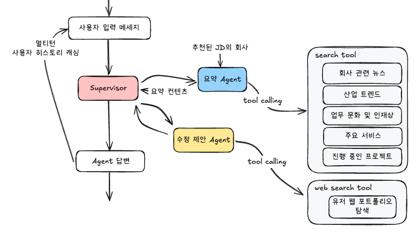
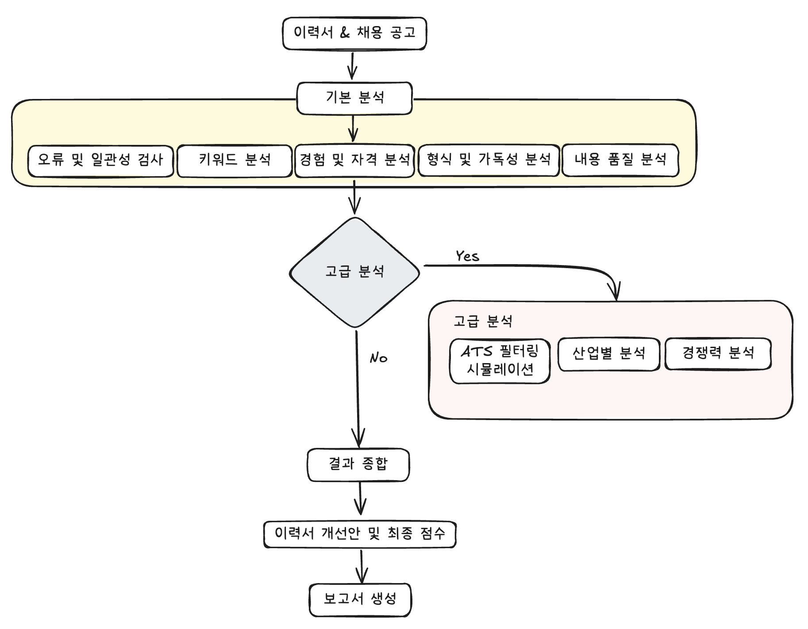
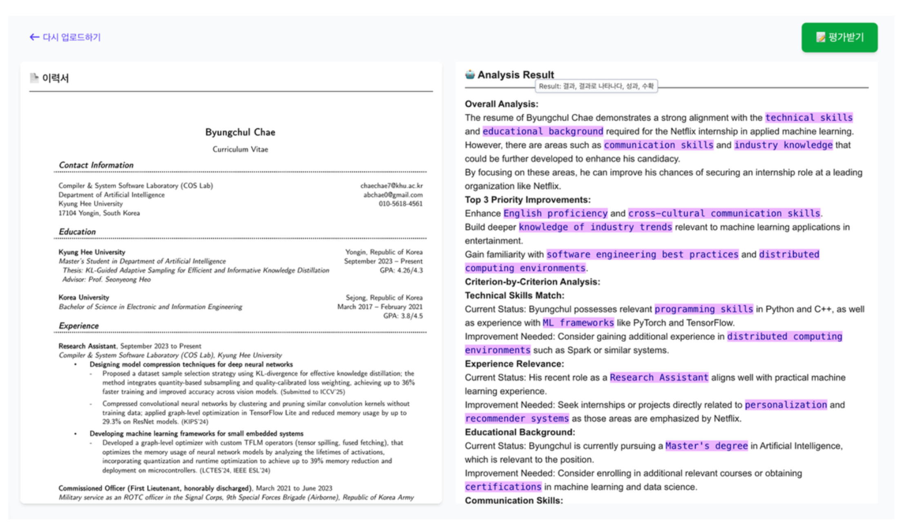
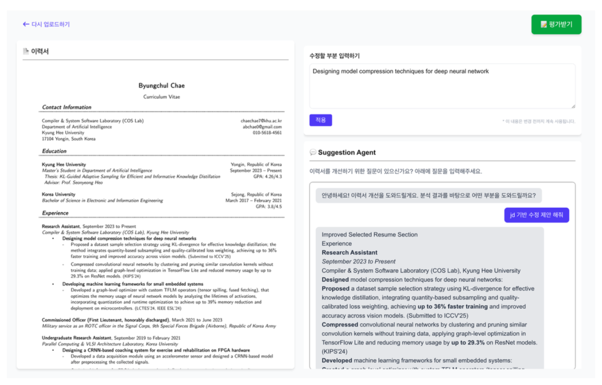

# JobPT

## 서비스 개요

<div align="center">

</div>


현대 사회에서 취업 준비는 반복적이고 시간 소모적인 과정으로, 구직자가 자신의 역량을 효과적으로 어필하지 못해 기회를 놓치는 경우가 많습니다. 이를 해결하기 위해 JobPT는 LLM 기반 **채용 공고 추천, 기업 맞춤형 이력서 피드백, 회사 정보 요약 제공, 이력서 적합성 평가**등의 기능을 갖춘 '**지능형 취업 지원 서비스**'를 제공합니다.

## 주요 기능

1. **LLM 기반 개인 이력서 맞춤형 채용 공고 매칭**
    - 제공받은 이력서를 RAG를 활용해 각 회사의 채용 공고와 의미론적 유사도를 기반으로 적합한 회사를 추천합니다.

2. **기업 맞춤형 이력서 피드백**
    - 유저와의 대화를 통해 평가-개선-재평가 프로세스를 거치며 이력서를 반복적으로 개선합니다. 
    - Multi-turn을 활용해 챗봇 인터페이스에서 유저에게 개선점을 제공하며, 이력서에 곧바로 반영합니다. (기능 반영 예정)

3. **회사 정보 요약 제공**
    - AI Agent를 통해 원하는 회사 또는 추천된 JD의 회사와 관련된 최신 정보를 요약해 제공합니다.
    - 산업 및 도메인, 경쟁력, 주요 서비스, 인재상, 사내 문화, 추진 중인 프로젝트 및 이니셔티브 등에 대한 메타 데이터를 요약합니다. 

3. **이력서 적합성 평가 및 구체적 개선점 제안**
    - 이력서 검토 시스템은 특정 JD에 맞춰 이력서를 분석하여 지원자 추적 시스템(ATS)이 이를 어떻게 평가할지 시뮬레이션합니다. 
    - 또한, 각 이력서를 해당 직무에 최적화할 수 있도록 상세한 피드백과 개선 제안도 제공합니다. 이 분석기는 각 직무 설명을 세밀하게 분석하여, 이력서가 해당 직무에 얼마나 잘 부합하는지 가장 정확하게 평가할 수 있도록 설계되었습니다.


## 시스템 구조도

### 전체 시스템 구조도


### 채용 공고 추천 RAG 구조도


### 이력서 수정 제안 및 회사 요약 Agent 구조도


### 검토 LLM 파이프라인



## 시스템 구성 기술
-   **크롤링 API**: 여러 회사 JD 데이터 확보 및 마감된 채용 공고 삭제
-   **PDF 파싱**: Upstage Parser를 이용한 다양한 형태의 이력서 PDF 텍스트 추출
-   **Vector DB**: Pinecone에 Job description(JD) 텍스트 Chunk 저장 및 JD Retrieval
-   **AI Agent**
    -  supervisor agent를 두어 멀티 agent로 파이프라인 구성
    -  회사 메타 데이터 정보 수집 및 요약 (Tavily Search MCP 사용)
    -  수정 제안 agent (유저의 웹 포트폴리오 탐색 MCP)
-   **LLM Model**
    -  이력서 적합성 평가

## 기술 스택
- Language: Python, Typescript
- LLM Framework
    - LangChain
    - Langgraph
    - OpenAI (text-embedding-3-small, gpt-4o, gpt-4o-mini, gpt-4.1-nano)
- Backend
    - Web Framework: FastAPI
    - Vector Database: Pinecone
    - Monitoring: Langfuse


## 서비스 데모 화면

### 시연 영상
-   [이력서 기반 JD 추천 기능 (Phase 1)](https://www.youtube.com/watch?v=m6EhfmpShCg)

### 웹 화면





## 환경 세팅

1.  프로젝트 루트 디렉토리에 `.env.example` 파일을 참고하여 `.env` 파일을 생성하고 API 키 및 환경 변수를 설정합니다.

    -   `FRONTEND_CORS_ORIGIN`: CORS 정책을 적용할 프론트엔드 주소를 입력합니다. (e.g., `http://localhost:3000`)
    -   `NODE_ENV`: 프론트엔드 `NODE_ENV` 환경을 설정합니다. (`development` 또는 `production`)

2.  (Optional) 로컬 환경에서 직접 실행할 경우, 각 서비스의 `requirements.txt` 또는 `package.json`을 참고하여 의존성을 설치합니다.

## 시스템 구동 방법

### Docker를 이용한 실행

프로젝트 루트 디렉토리에서 다음 명령어를 실행하여 Docker Compose로 전체 서비스를 실행합니다.

```bash
docker compose up [-d] [--build]
```

### 로컬 환경에서 직접 실행

API 실행

```bash
python backend/main.py
```

웹 화면 실행

```bash
npm --prefix frontend run dev
```

API 호출 예시 (api_test.py 참조)

```
import requests

# POST 요청 함수
def send_post_request(resume_path):
    url = "http://localhost:8000/matching"  # 실제 API 엔드포인트로 변경하세요.
    data = {"resume_path": resume_path}

    try:
        response = requests.post(url, json=data)
        response.raise_for_status()  # 상태 코드가 200번대가 아니면 예외 발생
        print("POST 요청 성공:", response.json())
    except requests.exceptions.RequestException as e:
        print("POST 요청 중 오류 발생:", e)


# 함수 호출 예시
send_post_request("data/joannadrummond-cv.pdf")
```
