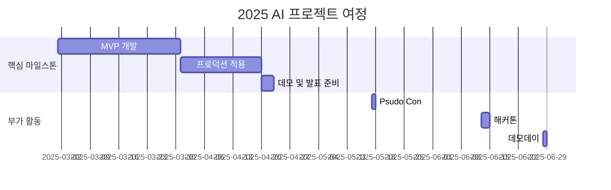

# 10th-template

<h1 align="center"> JobPT </h1>

<div align="center">
<a href="https://pseudo-lab.com"></a>
<a href="https://discord.gg/EPurkHVtp2"></a>
<a href="https://github.com/Pseudo-Lab/10th-template/stargazers"></a>
<a href="https://github.com/Pseudo-Lab/10th-template/network/members"></a>
<a href="https://github.com/Pseudo-Lab/10th-template/pulls"></a>
<a href="https://github.com/Pseudo-Lab/10th-template/issues"></a>
<a href="https://github.com/Pseudo-Lab/10th-template/graphs/contributors"></a>

</div>
<br>

<!-- sheilds: https://shields.io/ -->
<!-- hits badge: https://hits.seeyoufarm.com/ -->

> Welcome to JobPT repository!

## 🌟 프로젝트 목표 (Project Vision)
_“스스로 문제를 정의하고 체계적인 실험을 통해 주도적으로 해결책을 찾아가는 여정”_  
- 프로젝트 주제: 이력서 기반 JD 매칭 및 이력서 수정 제안 서비스 (주제가 이미 정해져있는 프로젝트입니다!)
- 현재 작업물의 키워드: RAG, 요약 및 수정 LLM, Agent
- 우리는 단순히 동작하는 결과물을 만드는 것이 아닌, 다음과 같은 가치있는 과정을 추구합니다:
1. 깊이 있는 탐구
    - 충분한 시간을 가지고 다양한 실험과 검증을 통해 최적의 방법론을 도출합니다
    - 2주마다 작은 성과를 만들어가며, 실패한 실험도 의미있는 기록으로 남깁니다
2. 함께 성장하고 공유하는 경험
    - 부족한 지식은 학습하고 발표를 통해 함께 공유합니다
    - 각자가 굵은 줄기를 담당하여 결국엔 모여 큰 나무가 되는 경험을 합니다


## 🧑 역동적인 팀 소개 (Dynamic Team)

| 역할          | 이름 |  기술 스택 배지                                                                 | 주요 관심 분야                          |
|---------------|------|-----------------------------------------------------------------------|----------------------------------------|
| **Project Manager** | 김민아 |   | LLM 검증 시스템 / Agent / 최적화              |
| **Member** | 최재강 |   | LLM 서빙 시스템 / 추론 최적화 / LLM 기반 평가                  |
| **Member** | 김민우 |   | 파운데이션모델 / 경량화 / 강화학습                  |


## 🚀 프로젝트 로드맵 (Project Roadmap)



## 🛠️ 우리의 개발 문화 (Our Development Culture)
**우리의 개발 문화**  
```python
class CollaborationFramework:
    def __init__(self):
        self.tools = {
            'communication': 'Discord',
            'version_control': 'GitHub Projects',
            'sprint_management': 'Notion'
        }
    
    def workflow(self):
        return """주간 사이클:
        1️⃣ 월요일: 개발로그 업로드
        2️⃣ 화요일: 프로젝트 진행 사항 및 인사이트 공유
        """
```

**특별한 이벤트!** 
- **2주마다 링크드인 포스팅 챌린지**: 자신이 담당한 부분에 대해 문제 정의, 실험 설계, 결과 및 인사이트를 정리하여 링크드인에 업로드합니다
- **새로운 도구나 기법 적용**: 새로운 도구나 기법을 시도할 때는 관련 논문을 함께 읽고 발표하거나, 툴을 리뷰하는 시간을 가집니다

## 💻 주차별 활동 (Activity History)

| 날짜 | 내용 | 발표자 | 
| -------- | -------- | ---- |
| 2025/03/04 | 프로젝트 소개 및 활동 OT       |      |
| 2025/03/11 |  Part 1. | 미정 | 
| 2025/03/18 |  Part 2. | 미정 | 
| 2025/03/25 |  Part 3. | 미정 | 
| 2025/04/01 |  Part 4. | 미정 | 
| 2025/04/08 |  Part 5. | 미정 | 


## 🌱 참여 안내 (How to Engage)
**팀원으로 참여하시려면 러너 모집 기간에 신청해주세요.**  
- 링크 (준비중)
- 팀원 모두는 링크드인 계정이 있어야 합니다.
- [프로젝트 개요](https://github.com/workdd/JobPT)를 보고 담당하고 싶은 기능이나 기대하는 부분에 대해서 알려주세요.

**누구나 청강을 통해 모임을 참여하실 수 있습니다.**  
1. 특별한 신청 없이 정기 모임 시간에 맞추어 디스코드 #Room- 채널로 입장
2. Magical Week 중 행사에 참가
3. Pseudo Lab 행사에서 만나기

## Acknowledgement 🙏

JobPT is developed as part of Pseudo-Lab's Open Research Initiative. Special thanks to our contributors and the open source community for their valuable insights and contributions.

## About Pseudo Lab 👋🏼</h2>

[Pseudo-Lab](https://pseudo-lab.com/) is a non-profit organization focused on advancing machine learning and AI technologies. Our core values of Sharing, Motivation, and Collaborative Joy drive us to create impactful open-source projects. With over 5k+ researchers, we are committed to advancing machine learning and AI technologies.

<h2>Contributors 😃</h2>
<a href="https://github.com/Pseudo-Lab/10th-template/graphs/contributors">
  
</a>
<br><br>

<h2>License 🗞</h2>

This project is licensed under the [MIT License](https://opensource.org/licenses/MIT).
