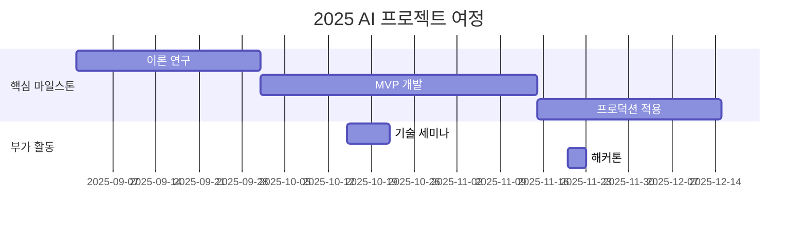

# 10th-template

<h1 align="center"> 10th Template </h1>

<div align="center">
<a href="https://pseudo-lab.com"></a>
<a href="https://discord.gg/EPurkHVtp2"></a>
<a href="https://github.com/Pseudo-Lab/10th-template/stargazers"></a>
<a href="https://github.com/Pseudo-Lab/10th-template/network/members"></a>
<a href="https://github.com/Pseudo-Lab/10th-template/pulls"></a>
<a href="https://github.com/Pseudo-Lab/10th-template/issues"></a>
<a href="https://github.com/Pseudo-Lab/10th-template/graphs/contributors"></a>
<a href="https://hits.seeyoufarm.com"></a>
</div>
<br>

<!-- sheilds: https://shields.io/ -->
<!-- hits badge: https://hits.seeyoufarm.com/ -->

> Welcome to OOO repository! We aim to OOO, offering tools and frameworks for OOO, OOO, and OOO. Join us in advancing the field of OOO through open collaboration and innovation!

## 🌟 프로젝트 목표 (Project Vision)
_"스스로 문제 정의와 실험 설계를 통해 주도적으로 문제를 해결해내는 것"_  
- 프로젝트 주제: 이력서 기반 JD 매칭 및 이력서 수정 제안 서비스 (주제가 이미 정해져있는 프로젝트입니다!)
- 현재 작업물의 키워드: RAG, 요약수정 LLM, Agent
- 목표: 프로젝트 하나를 완성하는 것은 물론, 이를 통해 문제를 명확히 정의하고 실험을 설계하여 해결하는 과정을 경험하는 데 중점을 둡니다.
- 이러한 과정에서 개인의 문제 해결 능력뿐 아니라, 팀원 간의 의견 공유와 협업을 통해 공동의 목표를 달성하는 역량을 강화하는 것을 목표로 합니다.


## 🧑 역동적인 팀 소개 (Dynamic Team)

| 역할          | 이름 |  기술 스택 배지                                                                 | 주요 관심 분야                          |
|---------------|------|-----------------------------------------------------------------------|----------------------------------------|
| **Project Manager** | 김민아 |   | LLM 검증 시스템 / RAG / 최적화              |
| **Member** | 최재강 |   | 데이터 파이프라인 설계                  |
| **Member** | 김민우 |   | 파운데이션모델 / 경량화 / 강화학습                  |


## 🚀 프로젝트 로드맵 (Project Roadmap)



## 🛠️ 우리의 개발 문화 (Our Development Culture)
**우리의 개발 문화**  
```python
class CollaborationFramework:
    def __init__(self):
        self.tools = {
            'communication': 'Discord',
            'version_control': 'GitHub Projects',
            'sprint_management': 'Notion'
        }
    
    def workflow(self):
        return """주간 사이클:
        1️⃣ 화요일: 프로젝트 사항 공유"""
```


## 💻 주차별 활동 (Activity History)

| 날짜 | 내용 | 발표자 | 
| -------- | -------- | ---- |
| 2025/02/25 | OT       |      |
| 2025/03/ |  Part 1. | 미정 | 
| 2025/03/ |  Part 2. | 미정 | 
| 2025/03/ |  Part 3. | 미정 | 
| 2025/03/ |  Part 4. | 미정 | 
| 2025/03/ |  Part 5. | 미정 | 


## 🌱 참여 안내 (How to Engage)
**팀원으로 참여하시려면 러너 모집 기간에 신청해주세요.**  
- 링크 (준비중)
- 팀원 모두는 링크드인 계정이 있어야 합니다.
- 프로젝트 개요를 보고 담당하고 싶은 기능이나 기대하는 부분에 대해서 알려주세요.

**누구나 청강을 통해 모임을 참여하실 수 있습니다.**  
1. 특별한 신청 없이 정기 모임 시간에 맞추어 디스코드 #Room- 채널로 입장
2. Magical Week 중 행사에 참가
3. Pseudo Lab 행사에서 만나기

## Acknowledgement 🙏

OOO is developed as part of Pseudo-Lab's Open Research Initiative. Special thanks to our contributors and the open source community for their valuable insights and contributions.

## About Pseudo Lab 👋🏼</h2>

[Pseudo-Lab](https://pseudo-lab.com/) is a non-profit organization focused on advancing machine learning and AI technologies. Our core values of Sharing, Motivation, and Collaborative Joy drive us to create impactful open-source projects. With over 5k+ researchers, we are committed to advancing machine learning and AI technologies.

<h2>Contributors 😃</h2>
<a href="https://github.com/Pseudo-Lab/10th-template/graphs/contributors">
  
</a>
<br><br>

<h2>License 🗞</h2>

This project is licensed under the [MIT License](https://opensource.org/licenses/MIT).
